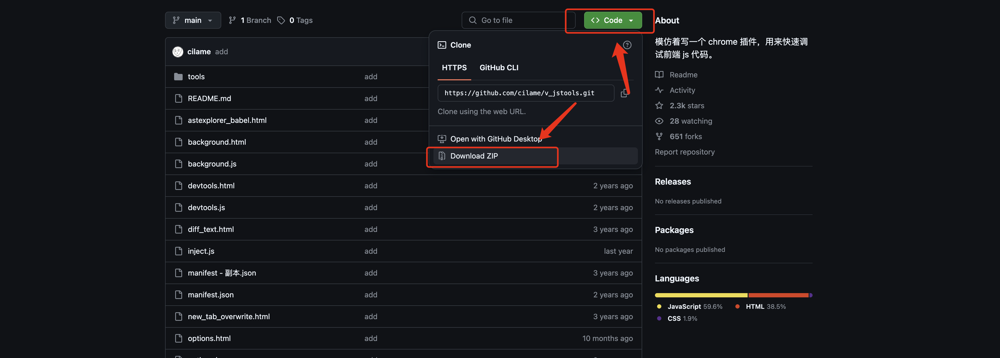
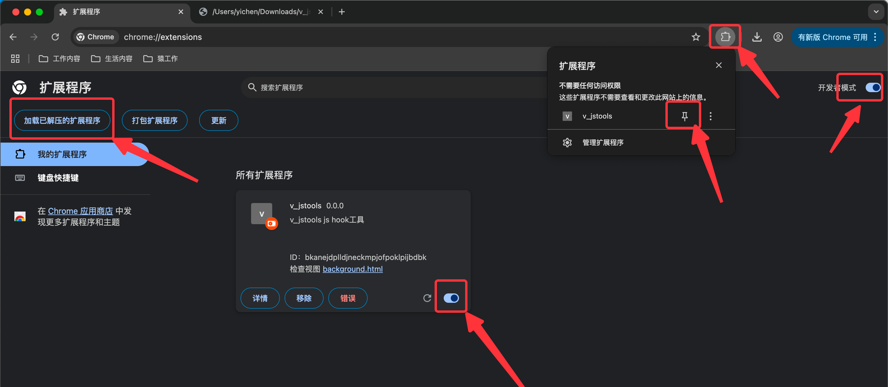
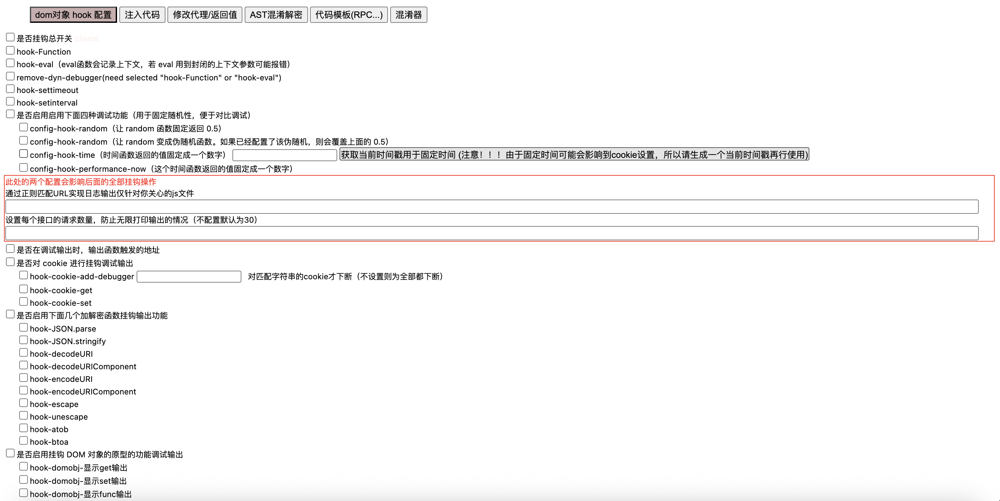

2025/05/20：修复了一些BUG，隐藏了一些注入时会产生的特征，使工具更难被检测到。

一，使用方式

1. 压缩包方式下载到本地

2. 下载后的压缩包解压备用，谷歌浏览器打开插件中心：chrome://extensions/ ，打开开发者模式，加载已解压的拓展程序，将下载的解压文件导入，右上角固定插件。

3. 右上角打开配置中心，既可查看当前所有功能配置

二，更多功能详解

为方便广大开发者更好地了解和使用 v_jstools，我与猿人学平哥合作，我们共同建立了一个微信交流群。扫码并备注 “jstools” 即可申请加入。 

在这个交流群中，我们会在群中优先分享工具的使用方法、实践案例，以及后续功能的更新与版本维护信息。同时，平哥也邀请了多位长期关注 jstools 的技术创作者加入，共同参与内容交流、经验分享以及共同对项目生态进行维护。欢迎感兴趣的朋友加入群聊，共建一个开放、实用的 v_jstools 工具交流社区。

